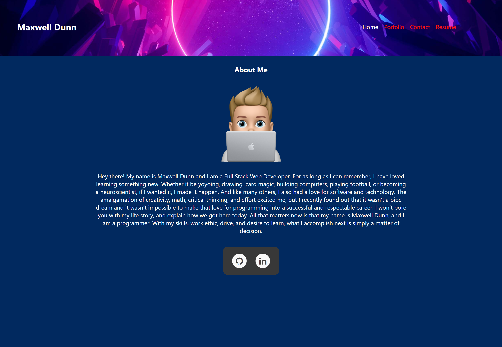
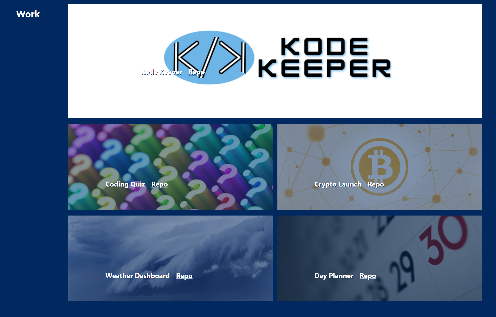

# React Portfolio

A front-end portfolio designed in React

https://maxd66.github.io/react-portfolio-v2/

## Description

This is a portfolio I designed with a react to host my work and some information about myself. There are pages to show off some of my work, allow visitors to contact me via email, and view my resume. I started with using the npm package create-react-app, which builds the structure for the client side of the application when using react.

## Installation and Usage

No Installation or usage information required.

## Credits

The npm package create-react-app was extremely useful and I highly recomend it for configuring your react applications.

### Home Page

### Work Page

